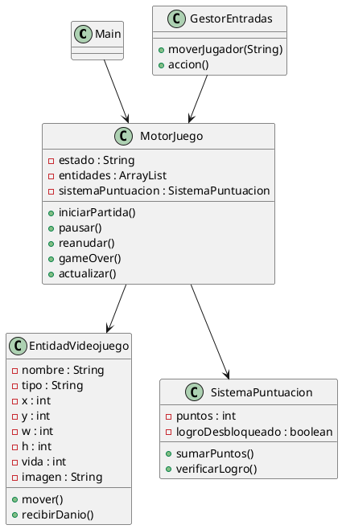
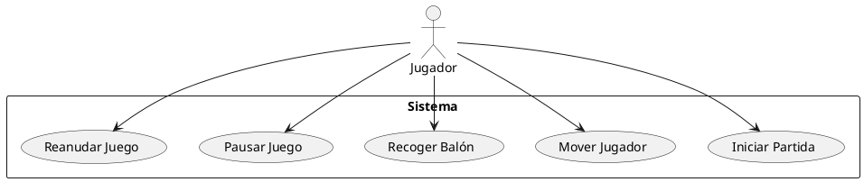

# Football Collector

## Descripción del Proyecto

Football Collector es un videojuego de fútbol en una cuadrícula 2D donde el jugador debe desplazarse por el campo para recoger balones y evitar a los defensas.

El proyecto implementa únicamente la lógica interna del motor del juego mediante consola, simulando el comportamiento de un videojuego móvil sin interfaz gráfica.

## Arquitectura del Software

### Main

Clase principal encargada de ejecutar la simulación y realizar las pruebas del sistema.

### MotorJuego

Controla el estado general del juego, gestiona las entidades y ejecuta el bucle principal.

### EntidadVideojuego

Representa cualquier elemento presente en el juego, como jugador, balones o defensas.

### GestorEntradas

Simula las acciones del jugador mediante comandos de movimiento y acciones.

### SistemaPuntuacion

Gestiona la puntuación de la partida y el desbloqueo de logros.

## Funcionalidades Implementadas

### Funcionalidades Básicas

* Inicio de partida.
* Pausa de partida.
* Reanudación de partida.
* Finalización de partida.
* Gestión de entidades.
* Simulación de entradas del jugador.
* Bucle principal de actualización.

### Funcionalidades Avanzadas

#### Detector de Colisiones

Permite detectar cuándo el jugador ocupa la misma posición que otra entidad.

Consecuencias:

* Recoger un balón suma puntos.
* Chocar con un defensa reduce la vida.

#### Sistema de Logros

Cuando el jugador alcanza 30 puntos se desbloquea automáticamente un logro especial.

## Diagrama de Clases UML

## Diagrama de Casos de Uso UML

