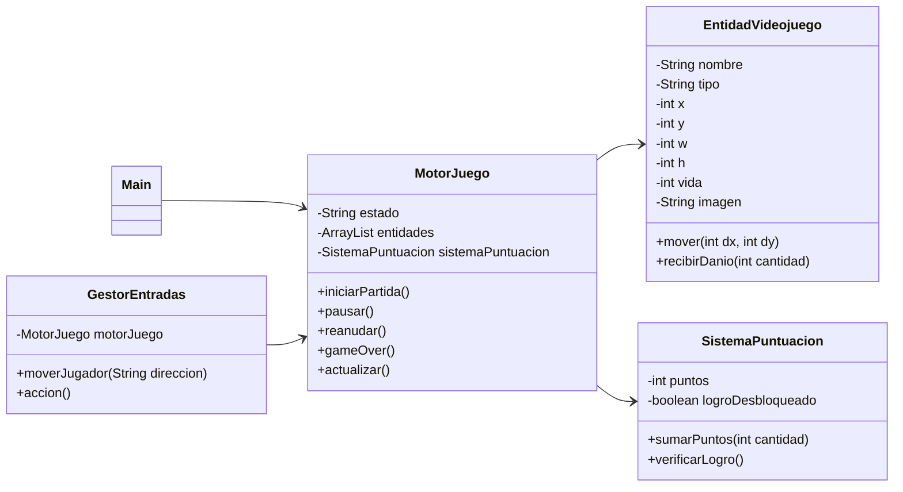
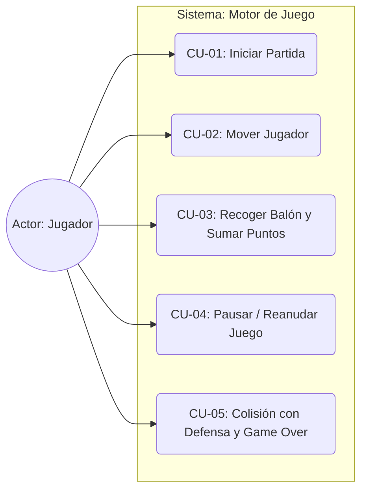

# Football Collector

## Descripción del Proyecto

Football Collector es un videojuego de fútbol en una cuadrícula 2D donde el jugador debe desplazarse por el campo para recoger balones y evitar a los defensas.

El proyecto implementa únicamente la lógica interna del motor del juego mediante consola, simulando el comportamiento de un videojuego móvil sin interfaz gráfica.

## Arquitectura del Software

### Main

Clase principal encargada de ejecutar la simulación y realizar las pruebas del sistema.

### MotorJuego

Controla el estado general del juego, gestiona las entidades y ejecuta el bucle principal.

### EntidadVideojuego

Representa cualquier elemento presente en el juego, como jugador, balones o defensas.

### GestorEntradas

Simula las acciones del jugador mediante comandos de movimiento y acciones.

### SistemaPuntuacion

Gestiona la puntuación de la partida y el desbloqueo de logros.

## Funcionalidades Implementadas

### Funcionalidades Básicas

* Inicio de partida.
* Pausa de partida.
* Reanudación de partida.
* Finalización de partida.
* Gestión de entidades.
* Simulación de entradas del jugador.
* Bucle principal de actualización.

### Funcionalidades Avanzadas

#### Detector de Colisiones

Permite detectar cuándo el jugador ocupa la misma posición que otra entidad.

Consecuencias:

* Recoger un balón suma puntos.
* Chocar con un defensa reduce la vida.

#### Sistema de Logros

Cuando el jugador alcanza 30 puntos se desbloquea automáticamente un logro especial.

## Diagrama de Clases UML

## Diagrama de Casos de Uso UML

## Especificación de Casos de Uso

### CU-01: Mover Jugador y Recoger Balón
| Campo | Descripción |
| :--- | :--- |
| **Nombre** | CU-01 Mover Jugador y Recoger Balón |
| **Objetivo** | Desplazar al jugador por la cuadrícula para recolectar un balón y aumentar la puntuación. |
| **Actor Principal** | Jugador |
| **Precondiciones** | El estado del juego debe ser "JUGANDO" y debe existir al menos una entidad tipo "Balon" en la misma fila/columna. |
| **Flujo Principal** | **1.** El jugador introduce un comando de movimiento (DERECHA). **2.** El sistema actualiza la posición del jugador en el eje X. **3.** El sistema ejecuta el método `actualizar()` del motor. **4.** El detector de colisiones verifica que las coordenadas $(x, y)$ del jugador y del balón coinciden. **5.** El sistema incrementa en 10 los puntos y elimina la entidad balón. |
| **Flujos Alternativos** | **4a.** Si el jugador se mueve a una casilla vacía, se actualiza la posición pero no se altera la puntuación ni las entidades. |
| **Postcondiciones** | La puntuación aumenta, el balón es eliminado del registro de entidades y el jugador cambia de posición. |
| **Reglas de Negocio** | No se pueden procesar movimientos ni comprobar colisiones si el estado del juego es "PAUSA" o "GAME_OVER". |

### CU-02: Colisión con Defensa y Game Over
| Campo | Descripción |
| :--- | :--- |
| **Nombre** | CU-02 Colisión con Defensa y Game Over |
| **Objetivo** | Gestionar el daño recibido por el jugador al colisionar con un enemigo y finalizar la partida si la vida llega a 0. |
| **Actor Principal** | Jugador / Sistema (NPC Defensa) |
| **Precondiciones** | El estado del juego debe ser "JUGANDO". El jugador debe estar en una posición adyacente o en ruta de colisión con el Defensa. |
| **Flujo Principal** | **1.** El motor ejecuta un tick de actualización. **2.** El NPC Defensa actualiza su posición moviéndose hacia la izquierda. **3.** El sistema detecta que el jugador y el defensa comparten la misma coordenada $(x, y)$. **4.** El jugador recibe 10 puntos de daño. **5.** El sistema detecta que la vida del jugador ha descendido a 0 (o menos). **6.** Se invoca automáticamente el método `gameOver()` cambiando el estado a "GAME_OVER". |
| **Flujos Alternativos** | **5a.** Si la vida restante del jugador es mayor que 0, el juego continúa activamente en estado "JUGANDO". |
| **Postcondiciones** | El estado del juego cambia de forma irreversible a "GAME_OVER" y se bloquean las entradas de control. |
| **Reglas de Negocio** | Al recibir daño, los puntos de vida del jugador nunca pueden quedar expresados en valores negativos (mínimo 0). |

---

## Bitácora del Uso de Inteligencia Artificial

### Herramienta utilizada
* **Modelo:** Gemini 3 Flash como colaborador de desarrollo de software bajo el rol de Arquitecto de Software y Desarrollador Java Senior.

### Muestra de Prompts
1.  *Prompt de Arquitectura:* "Actúa como un desarrollador Java senior. Necesito diseñar la estructura de clases para un motor de videojuego en consola 2D basado en una cuadrícula de fútbol. Tengo un límite estricto de 6 clases. Diseña las clases básicas para gestionar el estado de juego (Menú, Jugando, Pausa), las entidades (Jugador, Balón, Defensa) y las entradas simuladas."
2.  *Prompt de Funcionalidades Avanzadas:* "Ayúdame a escribir un método matemático de colisión simple dentro de la clase MotorJuego utilizando las propiedades X e Y de las entidades, de forma que si el jugador pisa un balón sume puntos, y si pisa un defensa le reste vida sin usar librerías externas."

### Control de Errores de la IA
Durante el co-diseño del software, la IA cometió un error de **sobreingeniería** al intentar utilizar la librería externa *Jackson* para implementar la funcionalidad avanzada de guardado rápido (`Quick Save`), proponiendo además añadir una clase externa `SaveManager.java`. 

* **Corrección aplicada:** Le recordé de manera directa las restricciones del enunciado: no podíamos añadir dependencias externas al entorno nativo de consola de Java ni podíamos exceder el límite de clases. Se le ordenó rectificar el diseño para estructurar el salvado simulado mediante un método nativo usando `StringBuilder` dentro de la clase `MotorJuego`, exportando un string plano con formato pseudo-JSON ejecutable en cualquier entorno estándar de Java.

### Reflexión Crítica
* **Ventajas:** El desarrollo asistido por IA reduce drásticamente el tiempo empleado en escribir código repetitivo (*boilerplate code*), como la generación de getters, setters, constructores y estructuras básicas de control. También facilita el diseño rápido de diagramas UML en texto plano (PlantUML).
* **Peligros:** Bajo la presión del tiempo, es fácil aceptar soluciones a ciegas. Si no se revisa con criterio de estudiante de DAW, la IA tiende a saltarse las restricciones de diseño del enunciado (creando jerarquías complejas de clases o usando librerías de terceros) o a romper principios de encapsulación (como los *magic strings* detectados en la lógica de control de tipos de entidad). La supervisión humana estricta sigue siendo indispensable.
## Evidencia de Ejecución

